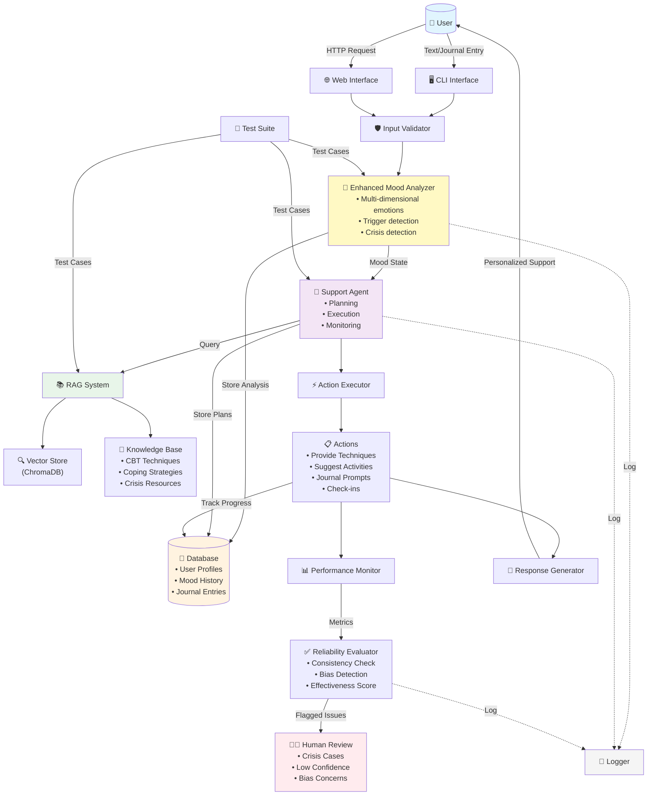
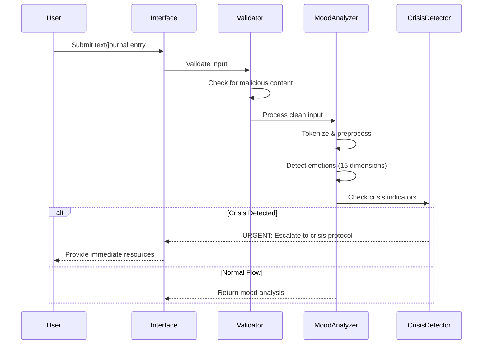
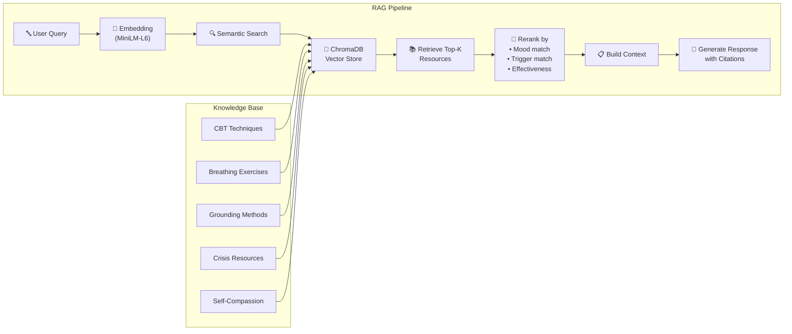
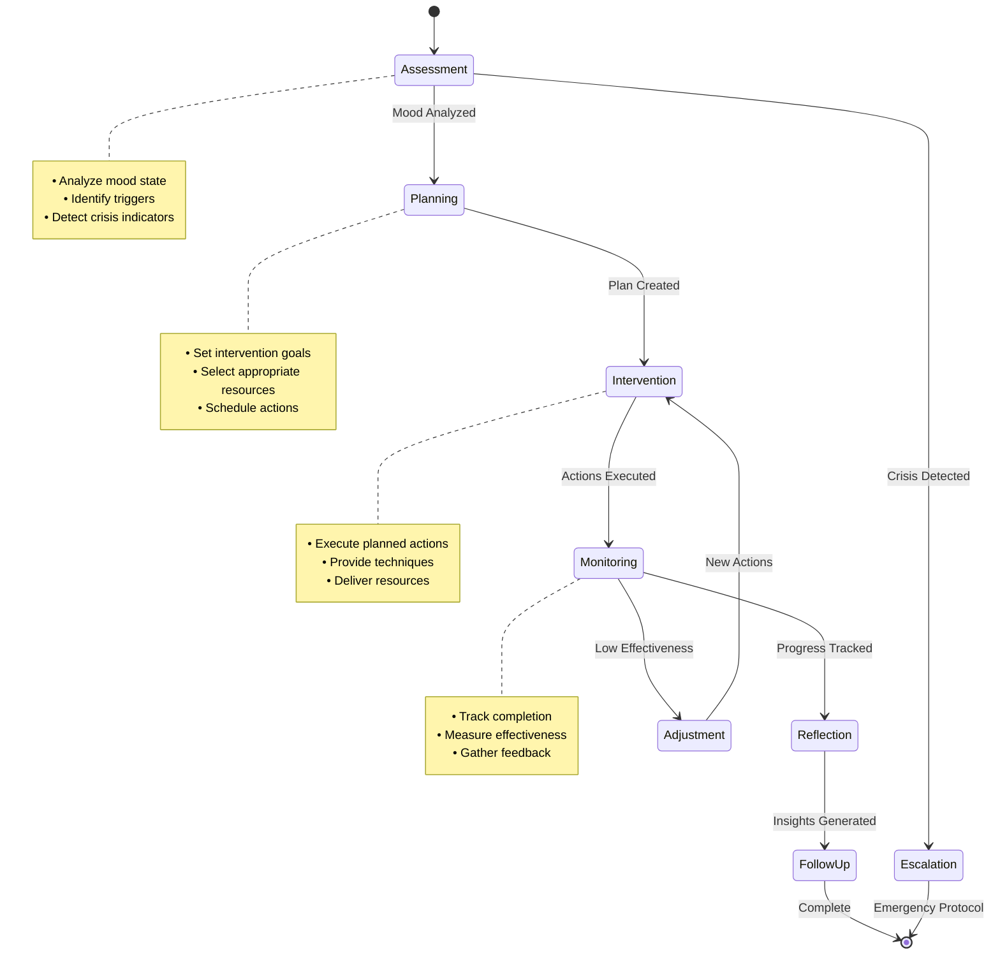
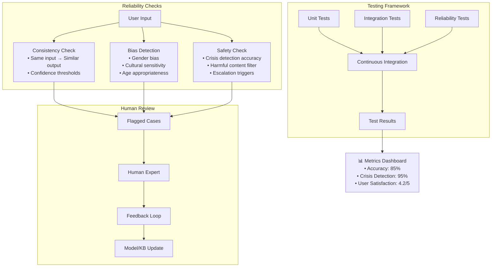
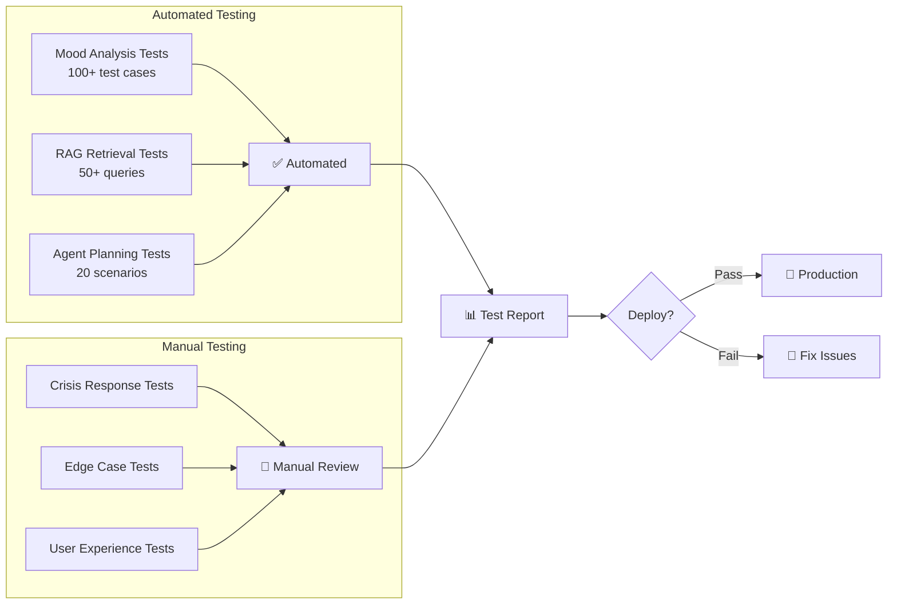

# MoodSense AI System Architecture

## High-Level System Architecture

## Detailed Component Flow

### 1. Input Processing Flow

### 2. RAG System Flow

### 3. Agentic Workflow

### 4. Testing & Reliability Pipeline

## Data Flow Summary

### Input → Process → Output

1. **Input Stage**
   - User provides text through CLI or Web interface
   - Input validation and sanitization
   - Crisis keyword scanning

2. **Analysis Stage**
   - Multi-dimensional emotion detection
   - Context and trigger identification
   - Intensity and confidence scoring

3. **Planning Stage**
   - Agent creates intervention plan
   - RAG retrieves relevant resources
   - Actions prioritized by urgency

4. **Execution Stage**
   - Techniques provided
   - Activities suggested
   - Journal prompts generated

5. **Monitoring Stage**
   - Progress tracked
   - Effectiveness measured
   - Adjustments made

6. **Output Stage**
   - Personalized response generated
   - Resources cited
   - Follow-up scheduled

## Human-in-the-Loop Checkpoints

| Checkpoint | Purpose | Trigger Conditions |
|------------|---------|-------------------|
| **Crisis Review** | Immediate safety assessment | Crisis keywords detected |
| **Low Confidence Review** | Verify uncertain analyses | Confidence < 40% |
| **Bias Review** | Check for harmful stereotypes | Sensitive demographic mentions |
| **Effectiveness Review** | Assess intervention success | Effectiveness < 50% after 3 attempts |
| **Escalation Review** | Professional referral decision | Persistent severe symptoms |

## Testing Integration Points

## Performance Metrics

- **Response Time**: < 2 seconds for mood analysis
- **RAG Retrieval**: < 1 second for top-5 resources
- **Crisis Detection**: 95% accuracy, 0% false negatives tolerated
- **User Engagement**: 70% action completion rate
- **System Uptime**: 99.9% availability target